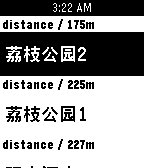
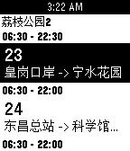
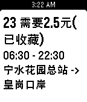
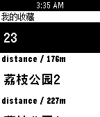

<header>
  <h1>Jason Yuan</h1>
  <h3>Web前端工程师</h3>
  

    

      <a href="tel:18673293104">18673293014</a>
    

    

      <a href="mailto:jiangege47@gmail.com">jiangege47@gmail.com</a>
    

    

      <a href="https://github.com/jiangege" target="_blank">jiangege</a>
    

    

      <a href="resume.pdf">下载PDF简历</a>
    

  

</header>

####  个人信息 
 - 姓名: 袁仓健 / Jason Yuan
 - 男，1995 年出生
 - 求职意向：Web前端工程师
 - 工作经验：8 年
 - 期望薪资：面谈

---

####  教育经历

- 湖南机电，专科，2013年毕业
---

####  工作经历

- **深圳凯歌科技有限公司，技术部门，前端负责人，2018.08 ~ 2020.04**

  负责数字货币交易平台的前端技术选型、架构搭建、制定代码规范、把控代码质量，管理团队的开发进度。

- **思必驰科技，技术部门，前端负责人，2017.05 ~ 2018.07**

  负责公司 TVUI 项目和故事机公众号的前端架构搭建以及所有开发工作。与项目经理沟通计划工时，跟进团队进度以确保按时完成开发任务。

- **GOGOVAN，技术部门，前端leader，2015.03 ~ 2017.03**

    负责公司网站前端以及司机端*Hybrid App*架构搭建、需求开发、日常Bug维护、组织会议共享开发进度及探讨相关技术难点、与产品部门评估需求协商以确定开发工时，根据需求优先级合理安排团队成员任务。

- **北京世通华纳传媒控股有限公司，技术部门，前端工程师， 2014.05 ~ 2015.03**

    负责所有web项目的前后端开发和维护工作、管理公司所有服务器、积极参与讨论公司技术转型方案，跟随上级面见投资人进行技术演示。

- **爱慧思科技有限公司，技术部门，前端工程师， 2014.05 ~ 2015.03**

    遵循公司现有开发规范编写全线产品的前端页面、编写开发文档、与后台联调交互完成产品需求、了解并熟悉公司业务需求，参加会议并汇报开发进度和讨论技术难点。

---

####  项目经历

- **Utomarket数字货币交易平台**

  > 使用到: Ant Design、React、Dva.js、Node.js、Solidy、Electron......

  Utomarket 是一个基于区块链技术的OTC数字货币交易平台。支持银行转账、礼品卡等 300 余种交易方式。我在该项目中主要负责前端架构搭建、前端核心开发工作、管理团队开发进度，同时还承担了部分后端开发工作。
  
  - 为了更好的保障用户资金安全和规避收黑钱风险，我调研了市场上大部分 *KYC* 技术并给出了技术实施方案，最终使用 *Node* 独立完成了开发工作；增加了3个方面的认证(证件验伪、人脸校对、活体检测)，有效的提升了用户身份的真实可靠性。
  - 由于后端需求较多，我参与了部分区块链钱包的调研和开发工作。使用 *Nodejs* 查询区块实现了 btc 转账确认的功能。
  - 基于ETH ERC-20 协议使用 *Solidty* 参与了部分平台币的开发工作。
  - 平台大额提现需要运营审核确认，因此后台管理系统需要更高级的安全防护，在调研了诸多技术方案后选择了使用 *USBKey* 这种软硬结合的模式，通过 *Websocket* 与 USB 程序通信并完成了与服务端的双因子认证，很好的解决了安全和易用性的问题。
  - 为了节省开发周期，前端选用了 *Ant design* 的整套方案，大大压缩了开发周期，3个月就完成了第一个版本。
  - 开发过程中，前后端对于同一需求的复杂度存在开发工时的差异，这导致了开发进度不同步。为了解决前后端依赖问题，我们在新迭代开始前会先协同制定接口规范，然后使用 yapi 平台编写接口用例；这样前端就可以在开发环境中使用yapi平台伪造的 *Mock* 数据而不依赖后端接口实现前端先行。

- **TVUI**
  
  > 使用到: Vue、Vuex、Vue-router、Casperjs......

  TVUI 是一个电视盒子声控解决方案，提供基本的UI和云服务能力，与 Siri 类似。我在项目中主要负责 h5 端的架构搭建以及代码开发。

  - 考虑到App体积不能太大，该项目虽有使用 *Hybrid App* 的需求，但并未使用 *Cordova* 方案，Android 同事通过暴露宿主对象的形式给前端提供了获取麦克风音量等本地化能力。项目架构是比较标准的 Vue 全家桶(Vue、Vuex、Vue-router)
  - 由于所有数据需要频繁从 Android 端透传过来，因此使用了 *Websocket* 进行数据通讯
  - 后期，随着项目代码越来越臃肿，为了提升项目的稳健性，使用了 *Casperjs* 对行为与界面的一致性进行了自动化测试

- **GoGovanDriver App**
  > 使用到: Cordova、Vue、Vuex、Mocha、Sass、Coffeescript......

  GoGovanDriver 是物流平台的司机端App，客户端发起订单，司机通过司机端接单，有点像＂滴滴打车货运版＂。我在项目中主要负责代码重构、新需求开发、制定编码规范，和 Code Review。
  - 使用 *Cordova* 开发driver端 *Hybrid App* ，实现了 Android、IOS 双平台兼容
  - 早期代码使用 *Jquery Mobile* 作为 UI 框架，代码没有良好的分层，View、State、Event和业务逻辑代码全混在一块，这导致了结构性和可维护性都极其之差，十分臃肿。随着需求的复杂化，除了拖累开发效率之外，还容易导致 Bug 产生。因此我提议使用 *Vue* 进行渐进式的重构，将View层和State层拆开，使用 *Vuex* 将状态有序的保存在状态机中。这种良好的分层和清晰的单向数据流大大提升了开发效率和代码的可维护性
  - 为了进一步提升代码的稳健性，重构之后使用了 *mocha* 编写测试用例
  - 由于每次发布时都需要重复繁琐的修改配置。使用 *Gulp* 编写了常用的task: 自动构建双端App、自动抓取i18n文本、Release 到云盘上供测试和运营下载。这大大节省了重复性工作导致的人力浪费问题。
  - 使用 *Webpack*  实现了代码模块化。使用 *Sass* 和 *CoffeeScript* 等超集语言来提升开发效率。

- **Towona Box**
  > 使用到: Backbone、Zepto、IScroll、require.js......

  Towona Box是提供在线H5小游戏及自有视频节目服务的Web App，主要是为了实现与公交屏双屏互动，及开放接口给第三方公司接入。我负责该项目的所有前后端开发和维护工作。
  - 项目选用了MVC框架 *Backbone* 作为基本骨架来实现单页SPA应用
  - 由于无需兼容pc，为了节省不必要的性能和体积浪费，使用 *Zepto* 替代了 *JQuery* ，使用了 *IScroll* 框架来使滚动更为流畅，让体验更加native
  - 在样式布局方面大量使用了 *CSS3 Flex* 盒模型来实现弹性布局
  - 为了使代码更加清晰，在代码模块化方面使用了遵循AMD规范的 *Require.js* 按需动态加载js
  - 使用 *Gulp* 作为项目构建工具，压缩代码和图片，以及合并与打包版本

---

#### 开源项目

- **Pebble Bus**

    

      
      
      
      
    

    抓包车来了接口，使用 *Pebblejs* 实现了查询附近公交到站时间的 Pebble App

    - 应用商店: [Rebble Store](https://store-beta.rebble.io/app/570019180cbe9e7b32000002)
    - 源码: [Github](https://store-beta.rebble.io/app/570019180cbe9e7b32000002)

- **HUSD/USD 数字货币套利脚本**

    根据 *HUSD/USD* 总是会回归1的特点，制作了一个稳定套利获取 HUSD 的脚本

    - 源码: [FMZ](https://www.fmz.com/strategy/164047)

- **神奇魔芋**
   
  抓取目录中的 *I18n* 文本，生成 JSON 配置文件
  - 源码: [Github](https://github.com/paean-tech/magicD)

- **豆瓣电影爬虫**

  爬取豆瓣电影数据

  - 源码: [Github](https://github.com/jiangege/dbmovie-crawler)

- **Random a Movie**
    
  随机获取一个指定评分区间内的电影资源

  - 源码: [Github](https://github.com/jiangege/random-movie)

---

####  技能清单
- ★★★ JavaScript、CSS、HTML
- ★★★ Vue、React
- ★★★ Git、Vim
- ★★☆ Cordova
- ★★☆ Nodejs、Mongodb、Redis、MySQL
- ★★☆ Webpack、Gulp、Browser
